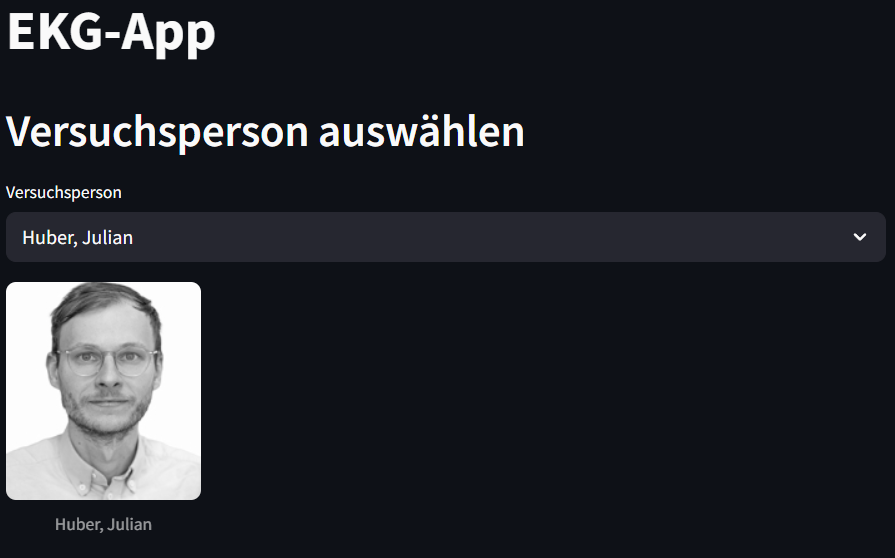
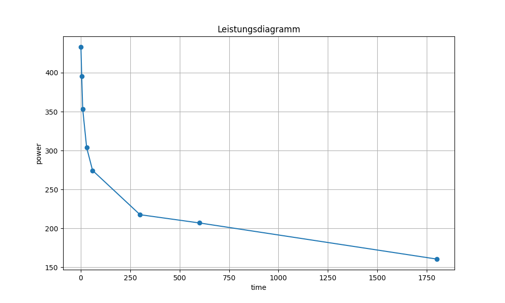

# aufgabe_3-5
Programmierübung 2 von Pia Schratt &amp; Gabriel Schwarz

## Beschreibung:
Die EKG App enthält Personendaten mit Fotos, die den bestimmten Personen zugeordnet sind und sich ändern, wenn man die Person wechselt.
Des Weiteren kann die maximale Herzfrequenz eingestellt werden, wodurch sich ein interaktiver Plot erstellt, der das Leistungs- und Herzfrequenzkurve anzeigt, wobei die Herzfrequenzzonen farblich hinterlegt sind und die durchschnittliche Leistung berechnet und ausgegeben wird, sowie die Zeit in den jeweiligen Zonen.

## Starten der App:
Um die App zu starten muss "streamlit run main.py" in der Console eingegeben werden, damit die App startet und man wird schon dort hin geleitet.

## Darstellung der App:

## Plot der Powercurve
